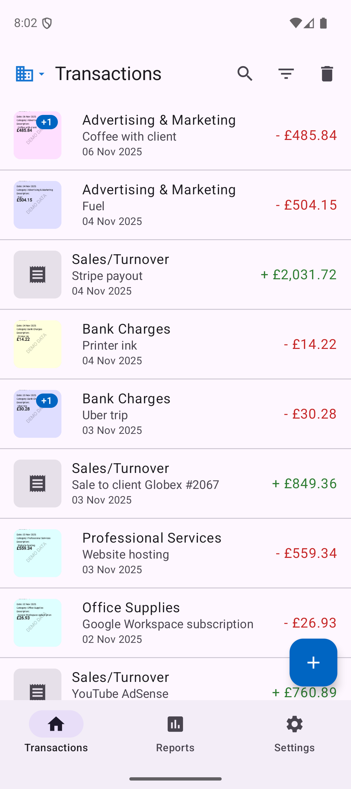
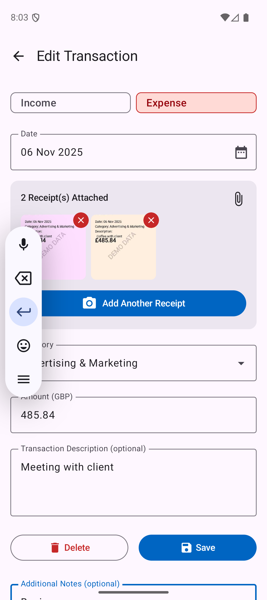
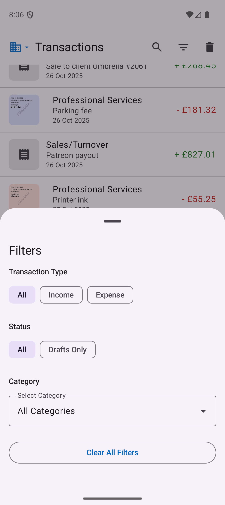
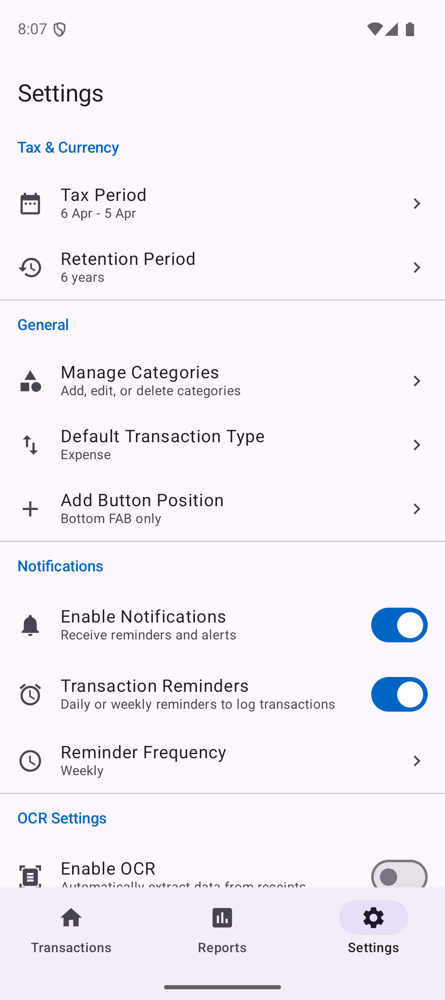

# HappyTaxes

**Proper bookkeeping. Private. Free.**

    

> A private, offline-first cash-basis bookkeeping app with receipt OCR. Made for freelancers, sole traders, small business, even personal finance. Track your finances, prepare for tax time, and keep your data yours.

## 📸 Screenshots

  
  
  
  
  
  

## ✨ Features

### 📊 Cash Basis Bookkeeping
- **Transaction date** - Simple, compliant cash accounting
- **Income and expense tracking** with category management
- **Receipt requirement** - Expenses must have proof (kept as drafts until attached)
- **Multi-profile support** - Separate books for personal, business, or multiple entities
- **6+ years of records** - Maintain compliant historical data

### 📸 Receipt Management
- **OCR with Tesseract4Android** - Extract data from receipts automatically (opt-in)
- **Photo compression** - Optimized storage without sacrificing quality
- **Receipt required for expenses** - Will save as draft without proof
- **Duplicate detection** - Warns on same date + amount + category (±7 days)

### 📈 Reports & Exports
- **Profit & Loss reports** - Tax-compliant financial statements
- **Multiple export formats** - CSV, PDF, ZIP with receipts
- **Flexible filtering** - By transaction type, date range, categories, receipt status
- **Tax year support** - UK (April-March), US (January-December), and custom periods
- **Archive functionality** - Export historical data with receipts

### 🔄 Smart Features
- **Draft system** - Transactions without receipts saved as drafts
- **Soft delete** - 30-day recovery period for deleted items
- **Search & filter** - Full-text search, amount ranges, date filters

### 🔒 Privacy First
- **100% offline** - No cloud, no servers, no accounts
- **Local storage only** - Your data never leaves your device
- **Device lock security** - Single-device storage with device lock protection
- **ZIP backup/restore** - Full control over your data
- **Zero tracking** - No analytics, no telemetry, no proprietary libraries
- **100% open-source software** - Buildable from source (MIT License)

## 📋 Requirements

- **Android 8.0 (API 26) or higher**
- **Camera permission** - For receipt capture (optional)
- **Storage permission** - For backup/restore and receipt photos

## 🔐 Permissions

- **CAMERA**: Capture receipt photos
- **READ_EXTERNAL_STORAGE / WRITE_EXTERNAL_STORAGE**: Backup/restore and receipt storage
- **POST_NOTIFICATIONS**: Reminders and tax year-end alerts (optional)

## 🚀 Getting Started

1. **Download** [latest version](https://github.com/dorumrr/happytaxes/releases) and install it
2. **Complete onboarding** - Select country, tax year, currency
3. **Start tracking** - Add income and expenses with receipts
4. **Generate reports** - View Profit & Loss, export data
5. **Backup regularly** - Use ZIP export to secure your data

## 🤝 Contributing

Help make HappyTaxes better. No contribution is too small!

### How to Contribute

1. **Fork the repository**
2. **Create a feature branch** (`git checkout -b feature/amazing-feature`)
3. **Make your changes**
4. **Commit your changes** (`git commit -m 'Add some amazing feature'`)
5. **Push to the branch** (`git push origin feature/amazing-feature`)
6. **Open a Pull Request**

All contributions are **valued** and **appreciated**!

## 📄 License

This project is licensed under the MIT License - see the [LICENSE](LICENSE) file for details.

## 💖 Support Development

Considerer donating to support the future of HappyTaxes if you find this initiative useful.

---

*Late nights for brighter days.*
